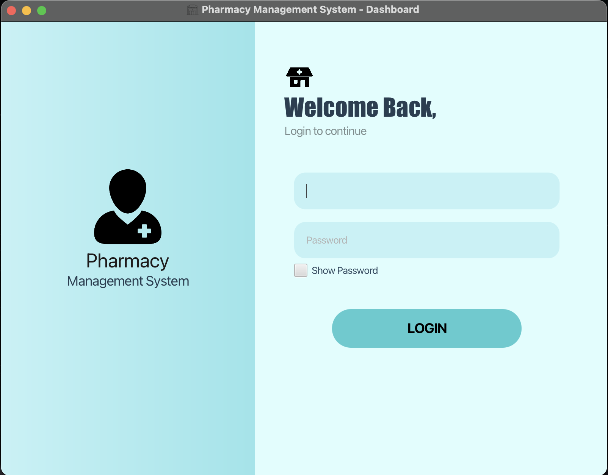
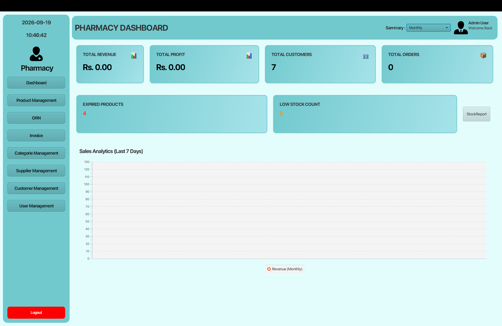
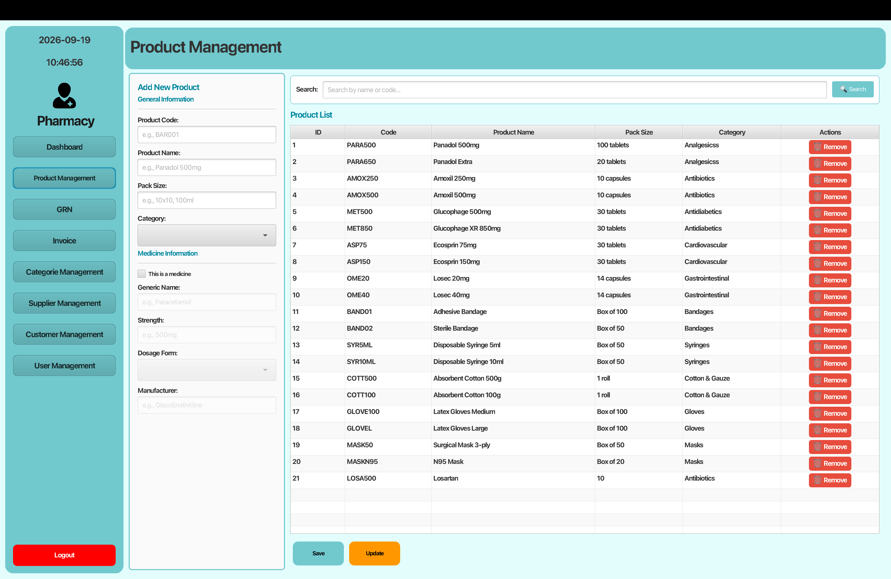
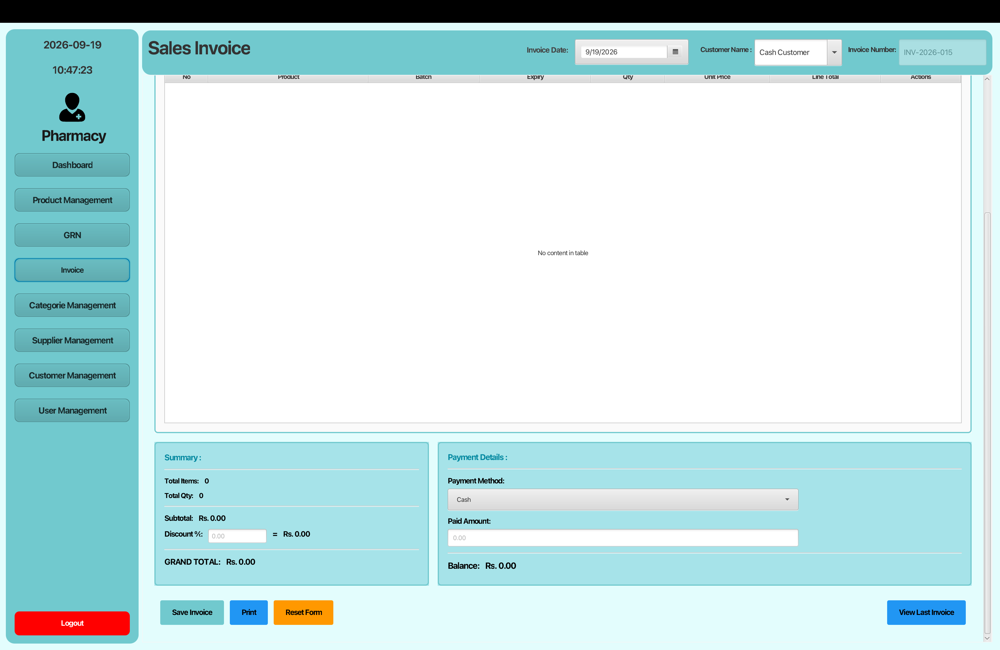
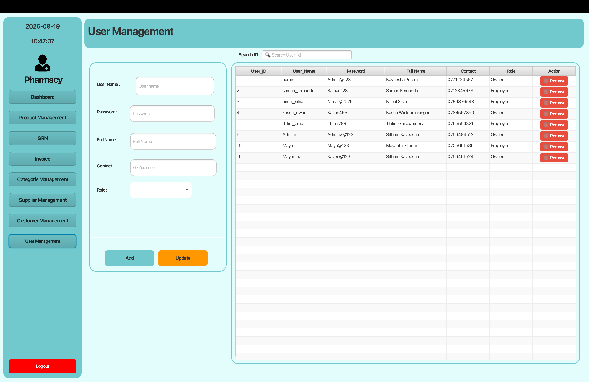

# Pharmacy Management System – Layered Architecture

A desktop **Pharmacy Management System** developed in **Java** using **JavaFX** for the UI and **MySQL** for data storage.  
The project follows a clean **layered architecture** (Controller → Business Object → Data Access Object) for better maintainability and separation of concerns.

**Repository:** [Mayantha2003/Pharmacy-Project-Layered--Architecture](https://github.com/Mayantha2003/Pharmacy-Project-Layered--Architecture)

---

## Features

- **User Authentication** – Secure login for admin/staff
- **Dashboard** – Overview of customers, stock, revenue, profit, orders, and expiry alerts
- **Product Management** – Add, update, delete, and search products
- **Category Management** – Organize medicines by category
- **Customer Management** – Maintain customer records
- **Supplier Management** – Manage supplier details
- **GRN (Goods Received Note)** – Record stock purchases from suppliers with batch tracking
- **Invoice / Billing** – Create sales invoices and process payments
- **User Management** – Manage system users
- **Stock Alerts** – Low stock and expired medicine notifications
- **Reports** – JasperReports for invoices and low-stock reports
- **Responsive UI** – JavaFX FXML-based modern interface

---

## Screenshots

### Login


### Dashboard


### Product Management


### Sales Invoice


### User Management


---

## Tech Stack

| Layer / Component     | Technology                          |
|-----------------------|-------------------------------------|
| Language              | Java 21                             |
| UI Framework          | JavaFX 21 (FXML + Controls)         |
| Build Tool            | Maven                               |
| Database              | MySQL                               |
| JDBC Driver           | MySQL Connector/J 9.x               |
| Reporting             | JasperReports 7.x                   |
| Architecture          | Layered (Controller → BO → DAO)     |
| Design Patterns       | Factory, Singleton, DTO, Entity, TM |

---

## Project Architecture (Layered)

```
┌─────────────────────────────────────┐
│           Presentation Layer        │  Controllers + FXML Views
│         (JavaFX Controllers)        │
└─────────────────┬───────────────────┘
                  │
┌─────────────────▼───────────────────┐
│         Business Logic Layer        │  BO interfaces + implementations
│              (BO Layer)             │
└─────────────────┬───────────────────┘
                  │
┌─────────────────▼───────────────────┐
│          Data Access Layer          │  DAO interfaces + implementations
│             (DAO Layer)             │
└─────────────────┬───────────────────┘
                  │
┌─────────────────▼───────────────────┐
│              Database               │  MySQL (pharmacy_db)
└─────────────────────────────────────┘
```

**Supporting packages:**
- `dto` – Data Transfer Objects
- `entity` – Database entity classes
- `view.tdm` – Table Model classes for JavaFX TableViews
- `db` – Database connection (Singleton)
- `util` – Helper utilities

---

## Prerequisites

- **JDK 21** or higher
- **Maven 3.8+**
- **MySQL Server 8.x** (or compatible)
- **IDE** (IntelliJ IDEA / Eclipse / VS Code) – optional but recommended

---

## Database Setup

1. Create a MySQL database:
   ```sql
   CREATE DATABASE pharmacy_db;
   ```

2. Update database credentials in:
   ```
   src/main/java/lk/ijse/pharamacymanagementlayerdsystem/db/DBConnection.java
   ```
   Default values:
   ```java
   jdbc:mysql://localhost:3306/pharmacy_db
   username: root
   password: mysql
   ```

3. Create the required tables (products, categories, customers, suppliers, users, batches, grn, invoice, etc.) according to your schema.

> **Note:** Make sure the database schema matches the entity and DAO implementations in the project.

---

## How to Run

### Option 1 – Using Maven (recommended)

```bash
# Clone the repository
git clone https://github.com/Mayantha2003/Pharmacy-Project-Layered--Architecture.git
cd Pharmacy-Project-Layered--Architecture

# Build the project
./mvnw clean compile

# Run the application
./mvnw javafx:run
```

### Option 2 – Using IDE

1. Open the project in IntelliJ IDEA / Eclipse.
2. Ensure the JDK is set to **21**.
3. Run the main class:
   ```
   lk.ijse.pharamacymanagementlayerdsystem.HelloApplication
   ```

---

## Project Structure

```
PharamacyManagementLayerdSystem/
├── src/main/java/lk/ijse/pharamacymanagementlayerdsystem/
│   ├── controller/          # JavaFX Controllers
│   ├── bo/                  # Business Object layer
│   │   ├── custom/
│   │   └── custom/impl/
│   ├── dao/                 # Data Access Object layer
│   │   ├── custom/
│   │   └── custom/impl/
│   ├── dto/                 # Data Transfer Objects
│   ├── entity/              # Entity classes
│   ├── view/tdm/            # Table Models
│   ├── db/                  # DB Connection
│   ├── util/                # Utilities
│   └── HelloApplication.java
├── src/main/resources/
│   └── lk/ijse/pharamacymanagementlayerdsystem/
│       ├── *.fxml           # UI screens
│       └── assests/
│           ├── image/       # Icons & images
│           └── report/      # JasperReports (.jrxml)
├── screenshots/             # Application screenshots
├── pom.xml
└── README.md
```

---

## Main Modules

| Module       | Description                                      |
|--------------|--------------------------------------------------|
| Login        | User authentication                              |
| Dashboard    | Stats, charts, low-stock & expiry alerts         |
| Product      | Medicine/product CRUD + batch awareness          |
| Category     | Product categories                               |
| Customer     | Customer management                              |
| Supplier     | Supplier management                              |
| GRN          | Goods Received Notes (purchase + stock in)       |
| Invoice      | Sales invoicing & payments                       |
| User         | System user management                           |

---

## Author

**G. D. Mayantha**  
GitHub: [Mayantha2003](https://github.com/Mayantha2003)

---

## License

This project is intended for educational / portfolio purposes.
